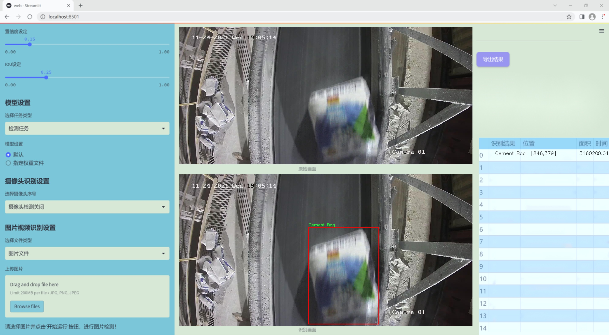
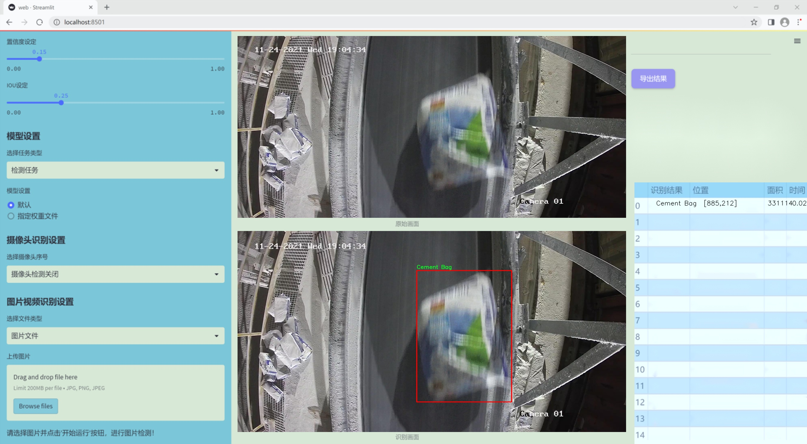
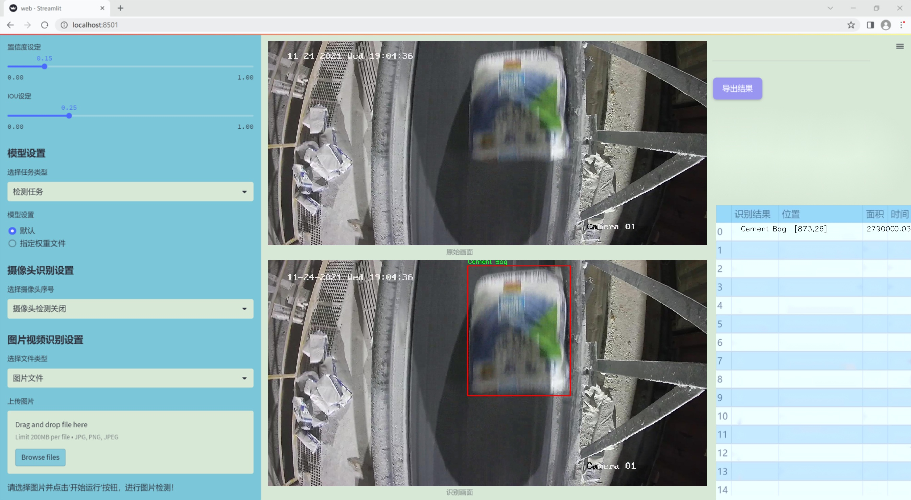
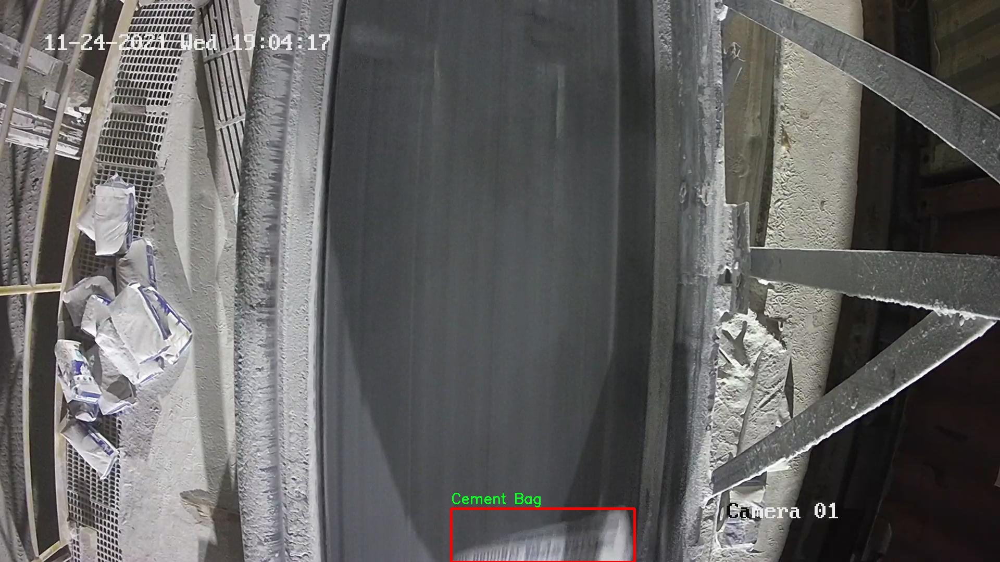
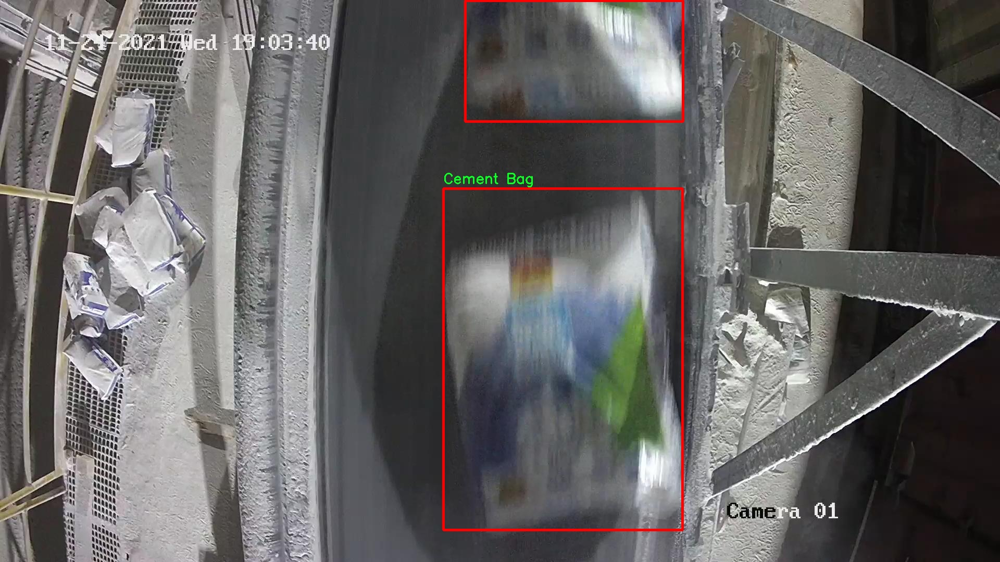
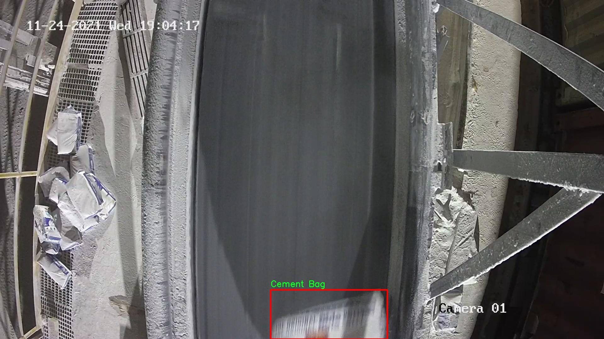
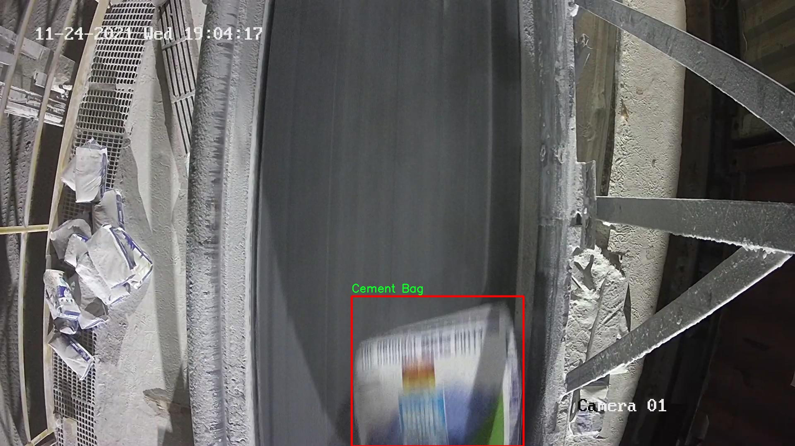
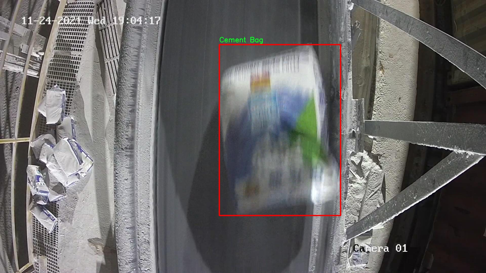

# 改进yolo11-RFCBAMConv等200+全套创新点大全：流水线水泥袋检测系统源码＆数据集全套

### 1.图片效果展示







##### 项目来源 **[人工智能促进会 2024.10.24](https://kdocs.cn/l/cszuIiCKVNis)**

注意：由于项目一直在更新迭代，上面“1.图片效果展示”和“2.视频效果展示”展示的系统图片或者视频可能为老版本，新版本在老版本的基础上升级如下：（实际效果以升级的新版本为准）

  （1）适配了YOLOV11的“目标检测”模型和“实例分割”模型，通过加载相应的权重（.pt）文件即可自适应加载模型。

  （2）支持“图片识别”、“视频识别”、“摄像头实时识别”三种识别模式。

  （3）支持“图片识别”、“视频识别”、“摄像头实时识别”三种识别结果保存导出，解决手动导出（容易卡顿出现爆内存）存在的问题，识别完自动保存结果并导出到tempDir中。

  （4）支持Web前端系统中的标题、背景图等自定义修改。

  另外本项目提供训练的数据集和训练教程,暂不提供权重文件（best.pt）,需要您按照教程进行训练后实现图片演示和Web前端界面演示的效果。

### 2.视频效果展示

[2.1 视频效果展示](https://www.bilibili.com/video/BV1H91NY3ES2/)

### 3.背景

研究背景与意义

随着全球建筑行业的快速发展，水泥作为基础建筑材料的重要性愈发凸显。水泥袋的生产与运输过程中的质量控制直接影响到建筑工程的安全性与耐久性。因此，建立一个高效、准确的水泥袋检测系统显得尤为重要。传统的人工检测方法不仅耗时耗力，而且容易受到人为因素的影响，导致检测结果的不一致性和不准确性。为了解决这一问题，基于深度学习的目标检测技术逐渐成为研究的热点。

YOLO（You Only Look Once）系列模型因其高效的实时检测能力和良好的检测精度，广泛应用于各类物体检测任务。随着YOLOv11的推出，其在特征提取和检测速度方面的进一步优化，使其成为理想的选择。然而，针对特定领域如水泥袋的检测，现有的YOLOv11模型可能需要进行一定的改进，以适应不同的环境和光照条件，提升其在实际应用中的表现。

本研究旨在基于改进的YOLOv11模型，构建一个流水线水泥袋检测系统。我们将使用一个包含3200张水泥袋图像的数据集，该数据集专门针对水泥袋的检测任务进行标注。通过对该数据集的深入分析与处理，结合改进的YOLOv11模型，我们期望能够实现对水泥袋的高效检测与分类，进而提高流水线生产的自动化水平和产品质量。

本项目的实施不仅能够为水泥行业提供一种新的检测手段，提升生产效率和质量控制水平，还能够为其他类似的工业检测提供借鉴，推动智能制造的发展。通过本研究，我们希望能够为深度学习在工业应用中的推广与普及贡献一份力量。

### 4.数据集信息展示

##### 4.1 本项目数据集详细数据（类别数＆类别名）

nc: 2
names: ['0', 'Cement Bag']


该项目为【目标检测】数据集，请在【训练教程和Web端加载模型教程（第三步）】这一步的时候按照【目标检测】部分的教程来训练

##### 4.2 本项目数据集信息介绍

本项目数据集信息介绍

本项目所使用的数据集名为“bwbags”，旨在为改进YOLOv11的流水线水泥袋检测系统提供高质量的训练数据。该数据集专注于水泥袋的识别与分类，具有重要的实际应用价值，尤其是在自动化生产和物流管理领域。数据集中包含两类目标，其中一类为背景（标记为‘0’），另一类为“Cement Bag”，即水泥袋。这种简单而明确的类别划分使得模型在训练过程中能够更有效地学习到水泥袋的特征，从而提高检测的准确性和效率。

“bwbags”数据集的构建经过精心设计，确保涵盖了多种不同环境和条件下的水泥袋图像，以增强模型的泛化能力。数据集中包含了多种拍摄角度、光照条件以及背景复杂度的样本，力求在真实场景中实现更高的检测性能。通过这种多样化的数据采集方式，模型不仅能够识别标准的水泥袋，还能在面对不同的外部干扰时保持稳定的检测效果。

在数据预处理阶段，所有图像均经过标准化处理，以确保输入数据的一致性和模型训练的高效性。此外，数据集还包括相应的标注信息，方便在训练过程中进行监督学习。随着YOLOv11算法的改进，利用“bwbags”数据集进行训练，将为流水线水泥袋的自动检测提供坚实的基础，推动相关行业的智能化进程，提升生产效率和产品质量。











### 5.全套项目环境部署视频教程（零基础手把手教学）

[5.1 所需软件PyCharm和Anaconda安装教程（第一步）](https://www.bilibili.com/video/BV1BoC1YCEKi/?spm_id_from=333.999.0.0&vd_source=bc9aec86d164b67a7004b996143742dc)


[5.2 安装Python虚拟环境创建和依赖库安装视频教程（第二步）](https://www.bilibili.com/video/BV1ZoC1YCEBw?spm_id_from=333.788.videopod.sections&vd_source=bc9aec86d164b67a7004b996143742dc)

### 6.改进YOLOv11训练教程和Web_UI前端加载模型教程（零基础手把手教学）

[6.1 改进YOLOv11训练教程和Web_UI前端加载模型教程（第三步）](https://www.bilibili.com/video/BV1BoC1YCEhR?spm_id_from=333.788.videopod.sections&vd_source=bc9aec86d164b67a7004b996143742dc)


按照上面的训练视频教程链接加载项目提供的数据集，运行train.py即可开始训练



     Epoch   gpu_mem       box       obj       cls    labels  img_size
     1/200     20.8G   0.01576   0.01955  0.007536        22      1280: 100%|██████████| 849/849 [14:42<00:00,  1.04s/it]
               Class     Images     Labels          P          R     mAP@.5 mAP@.5:.95: 100%|██████████| 213/213 [01:14<00:00,  2.87it/s]
                 all       3395      17314      0.994      0.957      0.0957      0.0843

     Epoch   gpu_mem       box       obj       cls    labels  img_size
     2/200     20.8G   0.01578   0.01923  0.007006        22      1280: 100%|██████████| 849/849 [14:44<00:00,  1.04s/it]
               Class     Images     Labels          P          R     mAP@.5 mAP@.5:.95: 100%|██████████| 213/213 [01:12<00:00,  2.95it/s]
                 all       3395      17314      0.996      0.956      0.0957      0.0845

     Epoch   gpu_mem       box       obj       cls    labels  img_size
     3/200     20.8G   0.01561    0.0191  0.006895        27      1280: 100%|██████████| 849/849 [10:56<00:00,  1.29it/s]
               Class     Images     Labels          P          R     mAP@.5 mAP@.5:.95: 100%|███████   | 187/213 [00:52<00:00,  4.04it/s]
                 all       3395      17314      0.996      0.957      0.0957      0.0845


###### [项目数据集下载链接](https://kdocs.cn/l/cszuIiCKVNis)

### 7.原始YOLOv11算法讲解


##### YOLO11介绍

Ultralytics YOLO11是一款尖端的、最先进的模型，它在之前YOLO版本成功的基础上进行了构建，并引入了新功能和改进，以进一步提升性能和灵活性。
**YOLO11设计快速、准确且易于使用，使其成为各种物体检测和跟踪、实例分割、图像分类以及姿态估计任务的绝佳选择。**


**结构图如下：**


##### **C3k2**

**C3k2，结构图如下**


**C3k2，继承自类`C2f，其中通过c3k设置False或者Ture来决定选择使用C3k还是`**Bottleneck


**实现代码** **ultralytics/nn/modules/block.py**

##### C2PSA介绍

**借鉴V10 PSA结构，实现了C2PSA和C2fPSA，最终选择了基于C2的C2PSA（可能涨点更好？）**


**实现代码** **ultralytics/nn/modules/block.py**

##### Detect介绍

**分类检测头引入了DWConv（更加轻量级，为后续二次创新提供了改进点），结构图如下（和V8的区别）：**


### 8.200+种全套改进YOLOV11创新点原理讲解

#### 8.1 200+种全套改进YOLOV11创新点原理讲解大全

由于篇幅限制，每个创新点的具体原理讲解就不全部展开，具体见下列网址中的改进模块对应项目的技术原理博客网址【Blog】（创新点均为模块化搭建，原理适配YOLOv5~YOLOv11等各种版本）

[改进模块技术原理博客【Blog】网址链接](https://gitee.com/qunmasj/good)


#### 8.2 精选部分改进YOLOV11创新点原理讲解

###### 这里节选部分改进创新点展开原理讲解(完整的改进原理见上图和[改进模块技术原理博客链接](https://gitee.com/qunmasj/good)【如果此小节的图加载失败可以通过CSDN或者Github搜索该博客的标题访问原始博客，原始博客图片显示正常】


### Context_Grided_Network(CGNet)简介
参考该博客提出的一种轻量化语义分割模型Context Grided Network(CGNet)，以满足设备的运行需要。

CGNet主要由CG块构建而成，CG块可以学习局部特征和周围环境上下文的联合特征，最后通过引入全局上下文特征进一步改善联合特征的学习。


 
下图给出了在Cityscapes数据集上对现有的一些语义分割模型的测试效果，横轴表示参数量，纵轴表示准确率(mIoU)。可以看出，在参数量较少的情况下，CGNet可以达到一个比较好的准确率。虽与高精度模型相去甚远，但在一些对精度要求不高、对实时性要求比较苛刻的情况下，很有价值。


高精度模型，如DeepLab、DFN、DenseASPP等，动不动就是几十M的参数，很难应用在移动设备上。而上图中红色的模型，相对内存占用较小，但它们的分割精度却不是很高。作者认为主要原因是，这些小网络大多遵循着分类网络的设计思路，并没有考虑语义分割任务更深层次的特点。

空间依赖性和上下文信息对提高分割精度有很大的作用。作者从该角度出发，提出了CG block，并进一步搭建了轻量级语义分割网络CGNet。CG块具有以下特点： 

学习局部特征和上下文特征的联合特征；
通过全局上下文特征改进上述联合特征；
可以贯穿应用在整个网络中，从low level（空间级别）到high level（语义级别）。不像PSPNet、DFN、DenseASPP等，只在编码阶段以后捕捉上下文特征。；
只有3个下采样，相比一般5个下采样的网络，能够更好地保留边缘信息。
CGNet遵循“深而薄”的原则设计，整个网络又51层构成。其中，为了降低计算，大量使用了channel-wise conv.

小型语义分割模型：

需要平衡准确率和系统开销
进化路线：ENet -> ICNet -> ESPNet
这些模型基本都基于分类网络设计，在分割准确率上效果并不是很好
上下文信息模型：

大多数现有模型只考虑解码阶段的上下文信息并且没有利用周围的上下文信息
注意力机制：

CG block使用全局上下文信息计算权重向量，并使用其细化局部特征和周围上下文特征的联合特征

#### Context Guided Block
CG block由4部分组成：


此外，CG block还采用了残差学习。文中提出了局部残差学习（LRL）和全局残差学习（GRL）两种方式。 LRL添加了从输入到联合特征提取器的连接，GRL添加了从输入到全局特征提取器的连接。从直观上来说，GRL比LRL更能促进网络中的信息传递（更像ResNet~~），后面实验部分也进行了测试，的确GRL更能提升分割精度。


CGNet的通用网络结构如下图所示，分为3个stage，第一个stage使用3个卷积层抽取特征，第二和第三个stage堆叠一定数量的CG block，具体个数可以根据情况调整。最后，通过1x1 conv得到分割结果。


下图是用于Cityscapes数据集的CGNet网络细节说明：输入尺寸为3*680*680；stage1连续使用了3个Conv-BN-PReLU组合，首个组合使用了stride=2的卷积，所以得到了1/2分辨率的feature map；stage2和stage3分别使用了多个CG block，且其中使用了不同大小的膨胀卷积核，最终分别得到了1/4和1/8的feature map。

需注意：

stage2&3的输入特征分别由其上一个stage的首个和最后一个block组合给出（参考上图的绿色箭头）；

输入注入机制，图中未体现，实际使用中，作者还将输入图像下采样1/4或1/8，分别给到stage2和stage3的输入中 ，以进一步加强特征传递。

channel-wise conv。为了缩减参数数量，在局部特征提取器和周围上下文特征提取器中使用了channel-wise卷积，可以消除跨通道的计算成本，同时节省内存占用。但是，没有像MobileNet等模型一样，在depth-wise卷积后面接point-wise卷积（1*1 conv），作者解释是，因为CG block需要保持局部特征和周围上下文特征的独立性，而1*1 conv会破坏这种独立性，所以效果欠佳，实验部分也进行了验证。

个人感觉此处应该指的是depth-wise卷积？

官方Git中对该部分的实现如下：


### 9.系统功能展示

图9.1.系统支持检测结果表格显示

  图9.2.系统支持置信度和IOU阈值手动调节

  图9.3.系统支持自定义加载权重文件best.pt(需要你通过步骤5中训练获得)

  图9.4.系统支持摄像头实时识别

  图9.5.系统支持图片识别

  图9.6.系统支持视频识别

  图9.7.系统支持识别结果文件自动保存

  图9.8.系统支持Excel导出检测结果数据


### 10. YOLOv11核心改进源码讲解

#### 10.1 EfficientFormerV2.py

以下是对代码的核心部分进行提炼和详细注释的结果：

```python
import torch
import torch.nn as nn
import math
import itertools

class Attention4D(nn.Module):
    """4D注意力机制模块"""
    def __init__(self, dim=384, key_dim=32, num_heads=8, attn_ratio=4, resolution=7, act_layer=nn.ReLU, stride=None):
        super().__init__()
        self.num_heads = num_heads  # 注意力头的数量
        self.scale = key_dim ** -0.5  # 缩放因子
        self.key_dim = key_dim  # 键的维度
        self.nh_kd = key_dim * num_heads  # 总的键维度

        # 如果有步幅，则进行下采样
        if stride is not None:
            self.resolution = math.ceil(resolution / stride)  # 更新分辨率
            self.stride_conv = nn.Sequential(
                nn.Conv2d(dim, dim, kernel_size=3, stride=stride, padding=1, groups=dim),
                nn.BatchNorm2d(dim),
            )
            self.upsample = nn.Upsample(scale_factor=stride, mode='bilinear')  # 上采样
        else:
            self.resolution = resolution
            self.stride_conv = None
            self.upsample = None

        self.N = self.resolution ** 2  # 位置数量
        self.d = int(attn_ratio * key_dim)  # 输出维度
        self.dh = self.d * num_heads  # 总的输出维度
        self.attn_ratio = attn_ratio  # 注意力比率

        # 定义查询、键、值的卷积层
        self.q = nn.Sequential(nn.Conv2d(dim, self.num_heads * self.key_dim, 1), nn.BatchNorm2d(self.num_heads * self.key_dim))
        self.k = nn.Sequential(nn.Conv2d(dim, self.num_heads * self.key_dim, 1), nn.BatchNorm2d(self.num_heads * self.key_dim))
        self.v = nn.Sequential(nn.Conv2d(dim, self.num_heads * self.d, 1), nn.BatchNorm2d(self.num_heads * self.d))

        # 定义局部值的卷积层
        self.v_local = nn.Sequential(
            nn.Conv2d(self.num_heads * self.d, self.num_heads * self.d, kernel_size=3, stride=1, padding=1, groups=self.num_heads * self.d),
            nn.BatchNorm2d(self.num_heads * self.d),
        )

        # 定义头部卷积层
        self.talking_head1 = nn.Conv2d(self.num_heads, self.num_heads, kernel_size=1)
        self.talking_head2 = nn.Conv2d(self.num_heads, self.num_heads, kernel_size=1)

        # 定义输出的卷积层
        self.proj = nn.Sequential(act_layer(), nn.Conv2d(self.dh, dim, 1), nn.BatchNorm2d(dim))

        # 计算注意力偏置
        points = list(itertools.product(range(self.resolution), range(self.resolution)))
        attention_offsets = {}
        idxs = []
        for p1 in points:
            for p2 in points:
                offset = (abs(p1[0] - p2[0]), abs(p1[1] - p2[1]))
                if offset not in attention_offsets:
                    attention_offsets[offset] = len(attention_offsets)
                idxs.append(attention_offsets[offset])
        self.attention_biases = nn.Parameter(torch.zeros(num_heads, len(attention_offsets)))  # 注意力偏置参数
        self.register_buffer('attention_bias_idxs', torch.LongTensor(idxs).view(self.N, self.N))  # 注册偏置索引

    def forward(self, x):  # x (B, C, H, W)
        B, C, H, W = x.shape
        if self.stride_conv is not None:
            x = self.stride_conv(x)  # 下采样

        # 计算查询、键、值
        q = self.q(x).flatten(2).reshape(B, self.num_heads, -1, self.N).permute(0, 1, 3, 2)
        k = self.k(x).flatten(2).reshape(B, self.num_heads, -1, self.N).permute(0, 1, 2, 3)
        v = self.v(x)
        v_local = self.v_local(v)
        v = v.flatten(2).reshape(B, self.num_heads, -1, self.N).permute(0, 1, 3, 2)

        # 计算注意力权重
        attn = (q @ k) * self.scale + self.attention_biases[:, self.attention_bias_idxs]
        attn = self.talking_head1(attn).softmax(dim=-1)  # 计算softmax
        attn = self.talking_head2(attn)

        # 计算输出
        x = (attn @ v)
        out = x.transpose(2, 3).reshape(B, self.dh, self.resolution, self.resolution) + v_local
        if self.upsample is not None:
            out = self.upsample(out)

        out = self.proj(out)  # 最后的投影
        return out


class EfficientFormerV2(nn.Module):
    """EfficientFormer V2模型"""
    def __init__(self, layers, embed_dims=None, mlp_ratios=4, downsamples=None, num_classes=1000, drop_rate=0., drop_path_rate=0.):
        super().__init__()
        self.patch_embed = nn.Sequential(
            nn.Conv2d(3, embed_dims[0], kernel_size=3, stride=2, padding=1),
            nn.BatchNorm2d(embed_dims[0]),
            nn.ReLU(),
        )  # 初始的嵌入层

        network = []
        for i in range(len(layers)):
            # 构建每一层的网络
            stage = eformer_block(embed_dims[i], i, layers, mlp_ratio=mlp_ratios)
            network.append(stage)
            if downsamples[i] or embed_dims[i] != embed_dims[i + 1]:
                # 如果需要下采样
                network.append(
                    nn.Conv2d(embed_dims[i], embed_dims[i + 1], kernel_size=3, stride=2, padding=1)
                )

        self.network = nn.ModuleList(network)  # 将网络模块化

    def forward(self, x):
        x = self.patch_embed(x)  # 通过嵌入层
        for block in self.network:
            x = block(x)  # 通过每一层
        return x


def efficientformerv2_s0(weights='', **kwargs):
    """构建S0版本的EfficientFormer V2模型"""
    model = EfficientFormerV2(
        layers=[2, 2, 6, 4],  # 每层的深度
        embed_dims=[32, 48, 96, 176],  # 每层的嵌入维度
        downsamples=[True, True, True, True],  # 是否下采样
        **kwargs
    )
    if weights:
        pretrained_weight = torch.load(weights)['model']
        model.load_state_dict(pretrained_weight)  # 加载预训练权重
    return model

# 其他版本的构建函数类似，省略...
```

### 代码核心部分说明：
1. **Attention4D**: 实现了一个4D注意力机制模块，包含了查询、键、值的计算，以及注意力权重的生成和应用。
2. **EfficientFormerV2**: 这是整个模型的核心类，负责构建网络结构，包括嵌入层和多个注意力块。
3. **efficientformerv2_s0**: 用于构建S0版本的EfficientFormer V2模型，并支持加载预训练权重。

以上代码保留了模型的核心结构和功能，并对每个部分进行了详细的中文注释。

这个文件定义了一个名为 `EfficientFormerV2` 的深度学习模型，主要用于图像处理任务，尤其是图像分类。模型的设计灵感来源于视觉变换器（Vision Transformer, ViT），并结合了卷积神经网络（CNN）的优点，以提高效率和性能。

首先，文件中定义了一些模型的超参数，包括不同版本的模型宽度和深度，这些参数通过字典进行管理。不同版本的模型（如 S0、S1、S2 和 L）具有不同的层数和通道数，适用于不同的计算资源和精度需求。

接下来，文件中定义了多个类来构建模型的各个组件。`Attention4D` 类实现了一个四维注意力机制，能够处理输入的特征图，并计算出相应的注意力权重。这个类支持不同的分辨率和步幅设置，以适应不同的输入特征图。

`LGQuery` 类用于生成局部查询特征，通过平均池化和卷积操作来获取输入特征的局部信息。`Attention4DDownsample` 类则结合了下采样和注意力机制，能够在特征图的分辨率降低时仍然保持有效的信息传递。

`Embedding` 类负责将输入图像转换为嵌入特征，支持多种不同的嵌入方式，包括轻量级嵌入和基于注意力的嵌入。`Mlp` 类实现了多层感知机（MLP），通过1x1卷积进行特征变换。

`AttnFFN` 和 `FFN` 类分别实现了带有注意力机制的前馈网络和普通前馈网络，前者在特征处理时引入了注意力机制，以增强模型的表达能力。

`eformer_block` 函数用于构建模型的基本模块，组合了不同的注意力和前馈网络，形成一个完整的网络块。`EfficientFormerV2` 类则是整个模型的核心，负责将各个模块组合在一起，形成完整的网络结构。

最后，文件中还定义了一些辅助函数，如 `update_weight` 用于加载预训练权重，以及 `efficientformerv2_s0`、`efficientformerv2_s1`、`efficientformerv2_s2` 和 `efficientformerv2_l` 函数，用于创建不同版本的模型实例。

在文件的最后部分，提供了一个简单的测试示例，通过随机生成的输入数据验证模型的输出尺寸。这一部分展示了如何实例化模型并进行前向传播，以确保模型的结构和功能正常。

总的来说，这个文件实现了一个高效的图像处理模型，结合了现代深度学习中的多种技术，旨在提高计算效率和分类性能。

#### 10.2 activation.py

```python
import torch
import torch.nn as nn

class AGLU(nn.Module):
    """AGLU激活函数模块，来源于https://github.com/kostas1515/AGLU。"""

    def __init__(self, device=None, dtype=None) -> None:
        """初始化AGLU激活函数模块。"""
        super().__init__()
        # 使用Softplus作为基础激活函数，beta设置为-1.0
        self.act = nn.Softplus(beta=-1.0)
        # 初始化lambda参数，确保其在指定设备和数据类型上
        self.lambd = nn.Parameter(nn.init.uniform_(torch.empty(1, device=device, dtype=dtype)))  # lambda参数
        # 初始化kappa参数，确保其在指定设备和数据类型上
        self.kappa = nn.Parameter(nn.init.uniform_(torch.empty(1, device=device, dtype=dtype)))  # kappa参数

    def forward(self, x: torch.Tensor) -> torch.Tensor:
        """计算AGLU激活函数的前向传播。"""
        # 将lambda参数限制在最小值0.0001，以避免数值不稳定
        lam = torch.clamp(self.lambd, min=0.0001)
        # 计算AGLU激活函数的输出
        return torch.exp((1 / lam) * self.act((self.kappa * x) - torch.log(lam)))
```

### 代码核心部分说明：
1. **AGLU类**：这是一个自定义的激活函数模块，继承自`nn.Module`。
2. **初始化方法**：
   - `self.act`：使用`Softplus`作为基础激活函数。
   - `self.lambd`和`self.kappa`：两个可学习的参数，分别用于调整激活函数的行为。
3. **前向传播方法**：
   - `lam`：对`lambd`参数进行限制，确保其不小于0.0001，以避免在计算中出现不稳定。
   - 返回值：根据AGLU激活函数的公式计算输出。

这个程序文件名为 `activation.py`，主要定义了一个名为 `AGLU` 的激活函数模块。该模块是基于一个统一的激活函数，源自于一个 GitHub 项目。文件中首先导入了 PyTorch 库及其神经网络模块。

在 `AGLU` 类的构造函数 `__init__` 中，首先调用了父类的构造函数以初始化模块。接着，定义了一个 `Softplus` 激活函数，参数 `beta` 被设置为 -1.0。`Softplus` 是一种平滑的激活函数，常用于神经网络中以增加非线性特性。

此外，类中还定义了两个可学习的参数 `lambd` 和 `kappa`，这两个参数通过均匀分布初始化，并且可以在训练过程中被优化。`lambd` 和 `kappa` 的初始化是通过 `torch.empty` 创建一个空的张量，然后使用 `nn.init.uniform_` 方法进行均匀初始化。

在 `forward` 方法中，定义了前向传播的计算过程。该方法接收一个张量 `x` 作为输入。首先，通过 `torch.clamp` 函数将 `lambd` 的值限制在 0.0001 以上，以避免出现负值或零值。接着，计算激活函数的输出，公式中包含了 `Softplus` 激活函数的结果以及 `lambd` 和 `kappa` 参数的影响，最终返回计算得到的张量。

整体来看，这个模块实现了一个自定义的激活函数，结合了 `Softplus` 和可学习的参数，旨在提高神经网络的表现。

#### 10.3 test_selective_scan_easy.py


这个程序文件 `test_selective_scan_easy.py` 主要实现了一个选择性扫描（Selective Scan）算法的功能，并且包含了相应的测试代码。选择性扫描是一种在处理序列数据时常用的技术，特别是在递归神经网络（RNN）和其他序列模型中。下面是对代码的详细说明。

首先，文件导入了一些必要的库，包括 `torch`（用于深度学习的库）、`pytest`（用于测试的库）以及 `einops`（用于张量重排的库）。然后定义了一个 `selective_scan_easy` 函数，它的主要任务是对输入的序列数据进行选择性扫描。

`selective_scan_easy` 函数的参数包括：
- `us`: 输入的序列数据，形状为 `(B, G * D, L)`，其中 `B` 是批次大小，`G` 是组数，`D` 是维度，`L` 是序列长度。
- `dts`: 时间增量，形状与 `us` 相同。
- `As`, `Bs`, `Cs`, `Ds`: 这些是与输入数据相关的权重矩阵，分别用于不同的计算。
- `delta_bias` 和 `delta_softplus`: 可选参数，用于调整时间增量。
- `return_last_state`: 是否返回最后的状态。
- `chunksize`: 处理数据的块大小。

在函数内部，首先定义了一个内部函数 `selective_scan_chunk`，用于处理数据块的选择性扫描逻辑。该函数使用了张量运算来计算当前状态和输出。

接下来，`selective_scan_easy` 函数会对输入数据进行一些预处理，包括数据类型转换、形状调整等。然后，它会将输入数据分块进行处理，调用 `selective_scan_chunk` 函数，并将结果存储在 `oys` 列表中。最后，函数将所有块的输出拼接在一起，并根据需要返回最后的状态。

接下来定义了一个 `SelectiveScanEasy` 类，继承自 `torch.autograd.Function`，用于实现自定义的前向和反向传播逻辑。该类的 `forward` 方法实现了选择性扫描的前向计算，而 `backward` 方法则实现了反向传播的梯度计算。

在文件的最后部分，定义了一些测试函数，包括 `test_selective_scan`，用于验证选择性扫描的实现是否正确。使用 `pytest` 进行参数化测试，确保在不同的输入条件下，选择性扫描的输出与参考实现的输出相匹配。

总体而言，这个程序文件实现了一个高效的选择性扫描算法，并通过测试确保其正确性，适用于处理序列数据的深度学习模型。

#### 10.3 CSwomTramsformer.py

以下是经过简化并添加详细中文注释的核心代码部分：

```python
import torch
import torch.nn as nn
import numpy as np

class Mlp(nn.Module):
    """多层感知机（MLP）模块"""
    def __init__(self, in_features, hidden_features=None, out_features=None, act_layer=nn.GELU, drop=0.):
        super().__init__()
        out_features = out_features or in_features  # 输出特征数
        hidden_features = hidden_features or in_features  # 隐藏层特征数
        self.fc1 = nn.Linear(in_features, hidden_features)  # 第一层线性变换
        self.act = act_layer()  # 激活函数
        self.fc2 = nn.Linear(hidden_features, out_features)  # 第二层线性变换
        self.drop = nn.Dropout(drop)  # Dropout层

    def forward(self, x):
        """前向传播"""
        x = self.fc1(x)  # 线性变换
        x = self.act(x)  # 激活
        x = self.drop(x)  # Dropout
        x = self.fc2(x)  # 线性变换
        x = self.drop(x)  # Dropout
        return x

class CSWinBlock(nn.Module):
    """CSWin Transformer的基本块"""
    def __init__(self, dim, num_heads, mlp_ratio=4., drop=0., attn_drop=0.):
        super().__init__()
        self.dim = dim  # 输入特征维度
        self.num_heads = num_heads  # 注意力头数
        self.mlp_ratio = mlp_ratio  # MLP的隐藏层与输入层的比率
        self.qkv = nn.Linear(dim, dim * 3)  # 线性变换用于生成Q、K、V
        self.norm1 = nn.LayerNorm(dim)  # 第一层归一化
        self.attn = LePEAttention(dim, num_heads=num_heads, attn_drop=attn_drop)  # 注意力模块
        self.mlp = Mlp(in_features=dim, hidden_features=int(dim * mlp_ratio), out_features=dim)  # MLP模块
        self.norm2 = nn.LayerNorm(dim)  # 第二层归一化

    def forward(self, x):
        """前向传播"""
        img = self.norm1(x)  # 归一化
        qkv = self.qkv(img).reshape(-1, 3, self.dim)  # 生成Q、K、V
        attn_out = self.attn(qkv)  # 注意力计算
        x = x + attn_out  # 残差连接
        x = x + self.mlp(self.norm2(x))  # MLP和残差连接
        return x

class CSWinTransformer(nn.Module):
    """CSWin Transformer模型"""
    def __init__(self, img_size=640, in_chans=3, num_classes=1000, embed_dim=96, depth=[2,2,6,2], num_heads=12):
        super().__init__()
        self.num_classes = num_classes  # 类别数
        self.embed_dim = embed_dim  # 嵌入维度
        self.stage1_conv_embed = nn.Sequential(
            nn.Conv2d(in_chans, embed_dim, 7, 4, 2),  # 卷积层
            nn.LayerNorm(embed_dim)  # 归一化层
        )
        self.stage1 = nn.ModuleList([
            CSWinBlock(dim=embed_dim, num_heads=num_heads) for _ in range(depth[0])  # 第一阶段的CSWinBlock
        ])
        # 其他阶段的定义省略...

    def forward(self, x):
        """前向传播"""
        x = self.stage1_conv_embed(x)  # 输入图像经过卷积嵌入
        for blk in self.stage1:
            x = blk(x)  # 通过每个CSWinBlock
        return x

# 创建模型实例并进行前向传播
if __name__ == '__main__':
    inputs = torch.randn((1, 3, 640, 640))  # 随机输入
    model = CSWinTransformer()  # 创建CSWin Transformer模型
    res = model(inputs)  # 前向传播
    print(res.size())  # 输出结果的尺寸
```

### 代码注释说明：
1. **Mlp类**：实现了一个简单的多层感知机，包含两个线性层和一个激活函数，支持Dropout。
2. **CSWinBlock类**：实现了CSWin Transformer的基本构建块，包含注意力机制和MLP模块，使用了残差连接。
3. **CSWinTransformer类**：整体模型的定义，包含多个阶段的处理，每个阶段由多个CSWinBlock组成。
4. **前向传播**：在主函数中，创建了一个随机输入并通过模型进行前向传播，输出结果的尺寸。

这个程序文件实现了一个名为CSWin Transformer的深度学习模型，主要用于计算机视觉任务。该模型是基于Transformer架构的，具有多种变体（如tiny、small、base和large），适用于不同的计算需求和数据集。

首先，文件中导入了必要的库，包括PyTorch及其相关模块，timm库用于处理图像数据和模型，einops库用于张量的重排列，以及其他一些实用工具。接着，定义了一些全局变量和模型的基本组件。

在模型的实现中，首先定义了一个Mlp类，表示多层感知机（MLP），包含两个线性层和一个激活函数（默认为GELU）。接下来是LePEAttention类，它实现了一种特定的注意力机制，利用局部和全局信息来增强特征表示。该类中包含了对输入图像进行窗口划分的功能，并通过卷积层提取特征。

CSWinBlock类则是模型的基本构建块，结合了MLP和注意力机制。每个块会对输入进行归一化、计算注意力、进行线性变换和MLP处理。该类还支持分支结构，使得模型在不同阶段可以处理不同维度的特征。

接下来，定义了图像到窗口和窗口到图像的转换函数，这些函数用于在注意力计算中处理图像数据的形状。Merge_Block类用于在不同阶段合并特征，进一步增强模型的表达能力。

CSWinTransformer类是整个模型的核心，负责构建不同的阶段，包括输入的卷积嵌入、多个CSWinBlock和合并块。模型的构造函数中包含了多个参数，用于控制模型的深度、头数、嵌入维度等超参数。

在模型的前向传播中，输入图像经过多个阶段的处理，最终输出特征图。模型还提供了权重初始化和加载预训练权重的功能。

最后，文件中定义了一些便捷函数（如CSWin_tiny、CSWin_small等），用于快速创建不同规模的CSWin Transformer模型，并可以选择加载预训练的权重。在主函数中，示例代码展示了如何创建这些模型并对随机输入进行前向传播，输出各层的特征图大小。

总体而言，这个程序文件实现了一个灵活且强大的视觉Transformer模型，适用于多种计算机视觉任务，如图像分类、目标检测等。

注意：由于此博客编辑较早，上面“10.YOLOv11核心改进源码讲解”中部分代码可能会优化升级，仅供参考学习，以“11.完整训练+Web前端界面+200+种全套创新点源码、数据集获取”的内容为准。

### 11.完整训练+Web前端界面+200+种全套创新点源码、数据集获取


# [下载链接：https://mbd.pub/o/bread/Zp2clZhu](https://mbd.pub/o/bread/Zp2clZhu)